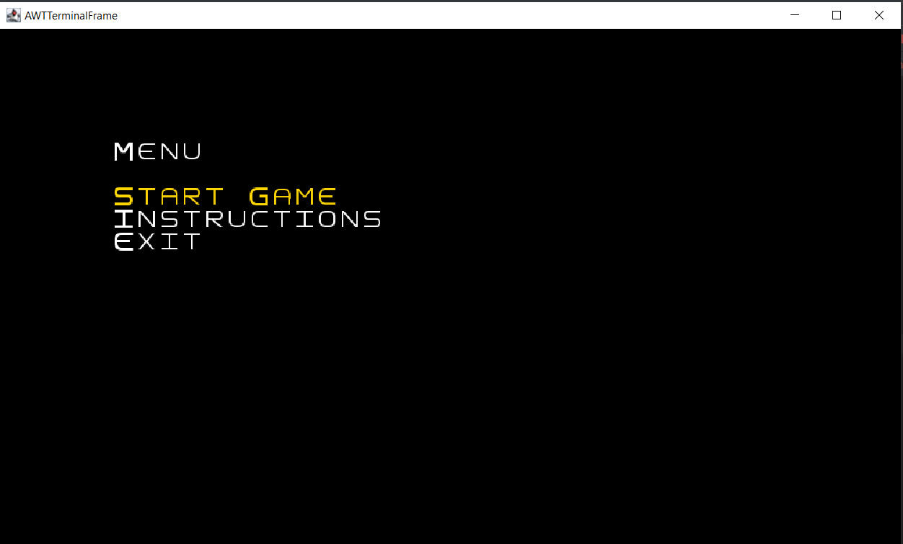
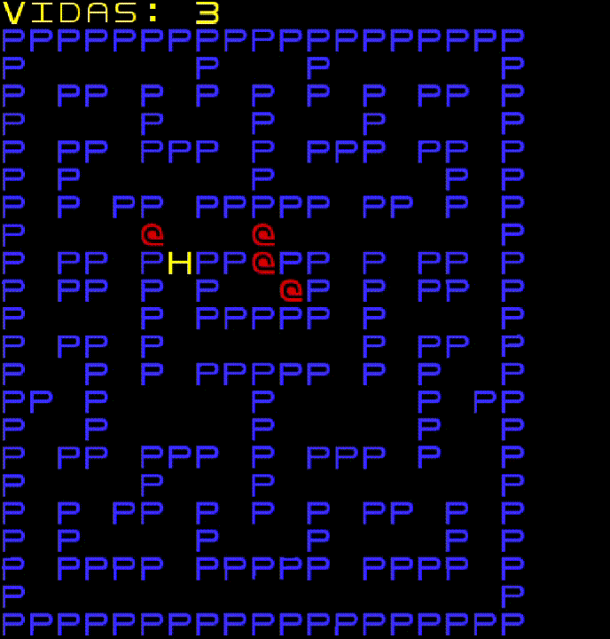
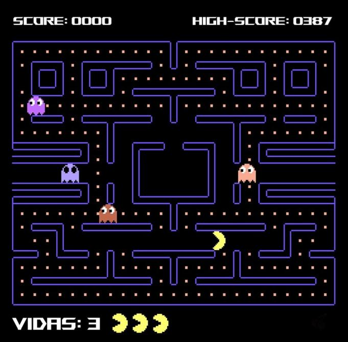
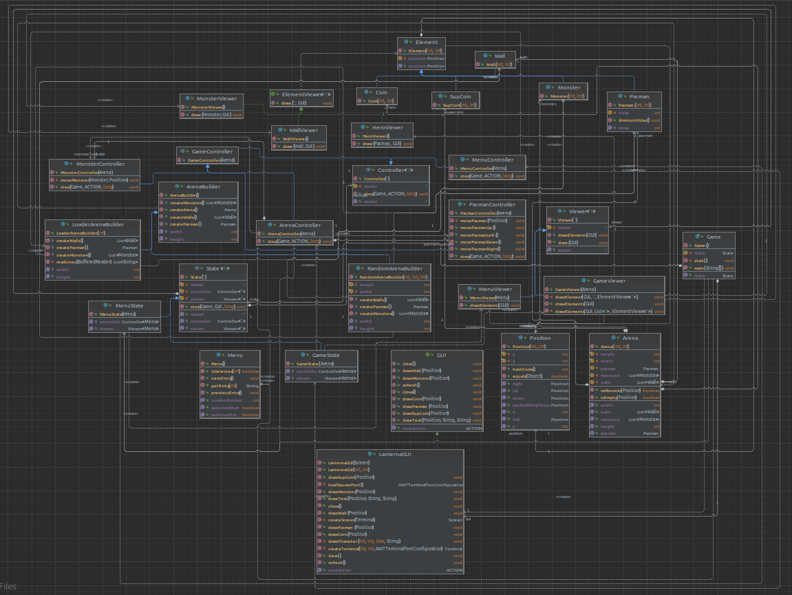

## project-l10gr01

Este jogo é uma implementação em java, usando o terminal lanterna, do clássico Packman, com o objetivo de percorrer um labirinto e comer todas as pastilhas do caminho, sem nunca ser atingido por um fantasma. Um jogador aumenta a sua pontuação, em 10 pontos, ao comer as pastilhas e 50 pontos ao comer uma super pastilha. A cada tentativa, o jogador possui 3 vidas e cada colisão com um fantasma diminui em 1 unidade o número de vidas. O jogador ganha se conseguir comer todas as pastilhas existentes no mapa enquanto o seu número de vidas é maior ou igual a 1. Se o número de vidas diminuir até 0, o jogador perde e volta a repetir o nível, só podendo avançar quando concluir com sucesso o nível atual.

Projeto desenvolvido por *Bernardo Pinto* (up202108842), *Eduardo Oliveira* (up202108690) e *João Oliveira* (up202108737).

*Nota* : Como permitido pelos professores, foi utilizado o código do projeto Hero-Solid do André Restivo como base para o desenvolvimento do nosso Pacman.

### Funcionalidades implementadas:

- **Menu principal:** Quando se inicia o jogo aparece o menu principal, onde é possível selecionar a opção de iniciar o jogo, consultar as regras e sair do menu. (Ainda vamos alterar praticamente o menu todo)

- **Sair do jogo:** A qualquer momento do programa, será possível sair do jogo carregando na letra "q".

- **Controlo do Jogador:** O jogador deve usar o teclado para jogar e os inputs do teclado são recebidos e interpretados.

- **Teclas para Jogar:** O jogador deve utilizar as 4 setas do teclado(arrow "up" para deslocar o Packman para cima, arrow "down" para deslocar o Packman para baixo, arrow "left" para deslocar o Packman para a esquerda e arrow "right" para deslocar o Packman para a direita)

- **Colisões:** As colisões entre os diferentes constituintes são analisadas (Ex: o jogador e os fantasmas a coidir com uma parede não a podem atravessar; o jogador a colidir com um fantasma levará a uma redução do número de vidas)

- **Menu Preview:**

- **Controlo de jogador Preview / Teclas para jogar Preview:**

### Funcionalidades planeadas:

- **Menu Instruções:** Menu onde são disponibilizadas todas as regras e informações necessárias para jogar o jogo.

- **Menu Game Over:** Se o jogador for atingido 3 vezes por um fantasma, perde e o jogo termina. No terminal aparece a sua pontução e o nível em que ficou.

- **Após perder nível:** Se o jogador perder o nível volta a repetir o nível, tendo a possibilidade de desistir. A pontuação máxima é atualizada sempre que o jogador fizer uma melhor pontuação.

- **Pontuações:** Valores Base: 1 pastilha = 10 pontos, 1 super pastilha = 50 pontos.

- **Fantasmas:** O movimento de cada fantasma é influênciado pelo movimento do pacman. Todos os fantasmas têm movimentos diferentes.

- **Níveis:** Quando um jogador come todas as pastilhas sem perder o jogo, passa para um novo nível, que apresenta um novo mapa e as vidas restantes do nível anterior.

- **Planemento da construção dos mapas:** Temos como objetivo construir 2 níveis em que cada nível difere apenas na organização dos diferentes constituintes, isto é, estrutura universal das paredes, posição das super pastilhas e o número de vidas que o jogador apresenta no segundo mapa são as vidas restantes do primeiro.
    
    - Construção do mapa: Para construirmos os mapas vamos utilizar um método de leitura de ficheiro em que cada linha vai representar uma linha do terminal e cada caracter vai representar uma coluna dessa linha.À medida que lemos os caracteres, com o auxilio de dois contadores, um para as linhas e outro para as colunas dessa linha, juntamente com a utilização do "TextGraphics" vamos preencher o terminal com as paredes, pastilhas, super pastilhas e os fantasmas.
  
    - Constituintes do mapa:
      - [#] - Representa uma parede, sendo pintada de azul escuro.
      - [c] - Representa uma pastilha, sendo pintada de amarelo.
      - [G] - Representa um "Gate".
      - [s] - Representa uma super pastilha, sendo pintada de amarelo escuro.
      - [A] - Representa um fantasma vermelho.
      - [B] - Representa um fantasma azul claro.
      - [C] - Representa um fantasma rosa.
      - [D] - Representa um fantasma laranja.

- **Músicas:** A nível de músicas temos como objetivo implementar sons quando o jogador perde o jogo , quando ocorre a colisão entre pacman e fantasma e quando ocorre a colisão entre pacman - pastilha/superPastilha.

### Design:

- **Design Patterns a implementar:**

    - Game Loop Pattern: Um "game loop" é executado continuamente durante o jogo. A cada loop, processa o input do utilizador sem bloquear, atualiza o estado do jogo e renderiza o mesmo.
        - O porquê de planearmos usar: Vamos usar  no controlo da movimentação do Pacman, assim como, no estado do jogo.

    - Factory Method Pattern: é um "creational design pattern" que fornece uma interface para criar objetos numa superclass, mas permite que as subclasses alterem o tipo dos objetos que serão criados.
        - O porquê de planearmos usar: Vamos usar no estado do jogo e do menu.

    - Outros possivelmente.

- **Design Patterns implementados:**
    - State Pattern: Permite um objeto alterar o seu comportamento quando o seu estado interno é alterado.
        - O porquê usarmos : Usado para o estado do jogo e o estado do menu.

### Testing:

### Game MoockUp:

### UML

### UML using Plugins:

### Participação dos elementos do grupo:
- **Bernardo Pinto -> 33,333%
- **Eduardo Oliveira -> 33,333%
- **João Oliveira -> 33,333%
