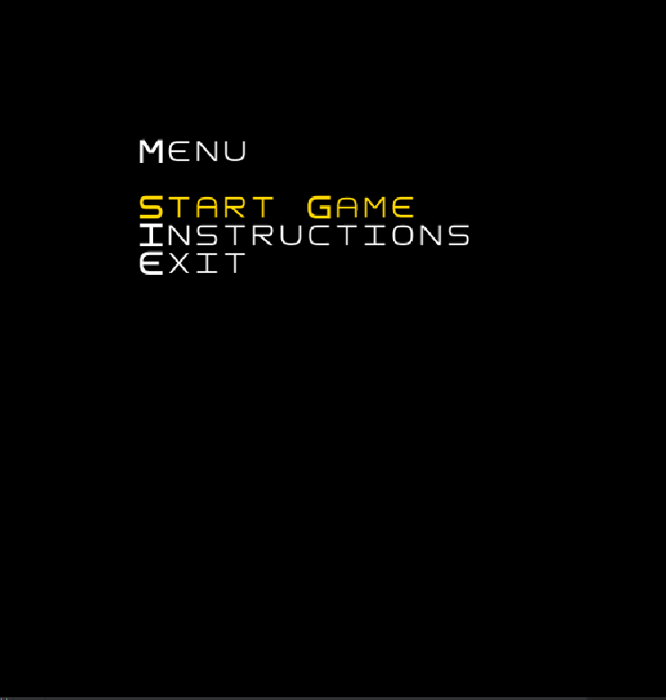
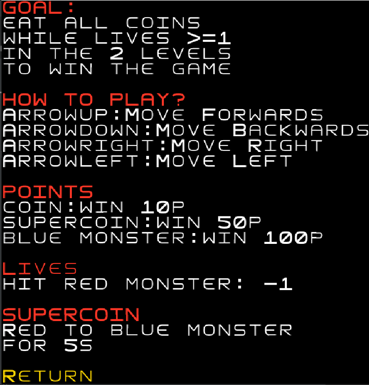
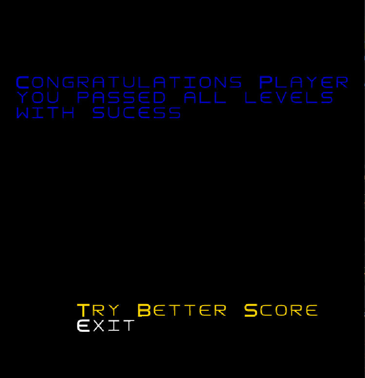
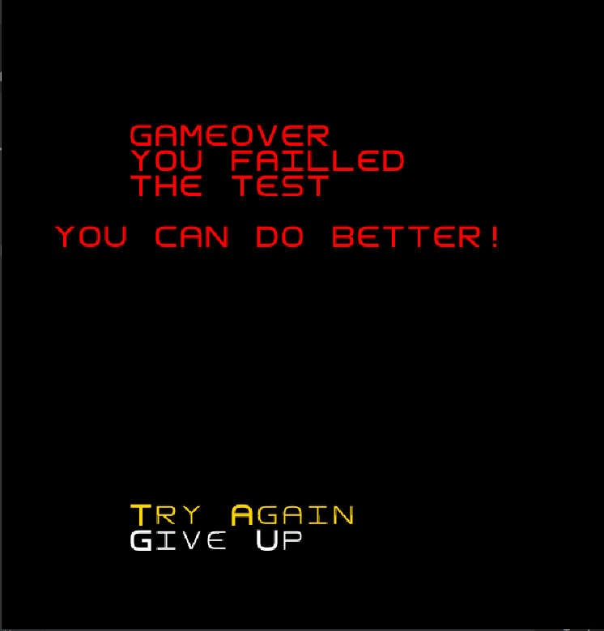
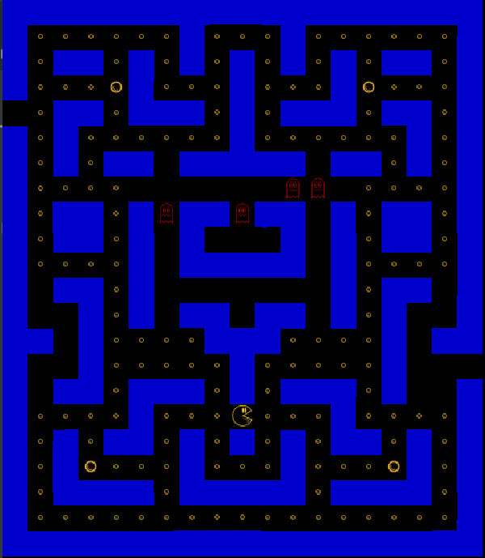
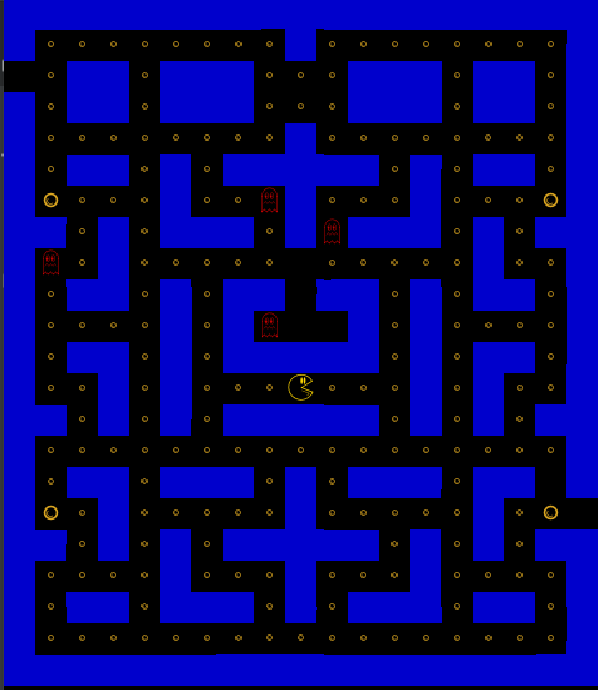

# LDTS_l10gr01 - Pacman

## Game Description

Este jogo é uma implementação em java, usando o terminal lanterna, do clássico Packman, com o objetivo de percorrer um labirinto e comer todas as pastilhas do caminho, sem nunca ser atingido por um fantasma. Um jogador aumenta a sua pontuação, em 10 pontos, ao comer as pastilhas e 50 pontos ao comer uma super pastilha. A cada tentativa, o jogador possui 3 vidas e cada colisão com um fantasma diminui em 1 unidade o número de vidas ou aumenta o número de pontos dependendo se o Pacman está com poder ou não, poder este proveniente de uma super pastilha.
O jogador ganha se conseguir comer todas as pastilhas existentes nos dois mapas enquanto o seu número de vidas é maior ou igual a 1. Se o número de vidas diminuir até 0, o jogador perde e volta ao primeiro nível, só ganhando se conseguir passar os dois mapas de seguida.

Projeto desenvolvido por Bernardo Pinto (up202108842), Eduardo Oliveira (up202108690) e João Oliveira (up202108737).

## Implemented Features

- **Menu principal:** Quando se inicia o jogo aparece o menu principal, onde é possível selecionar a opção de iniciar o jogo, consultar as regras e sair do menu.

- **Menu GameOver:** Se o jogador for atingido 3 vezes por um fantasma, perde e tem a possibilidade de desistir ou de voltar a repetir.

- **Menu GameWin:** Se o jogador comer todas as pastilhas e super pastilhas do primeiro mapa e segundo mapa enquanto as suas vidas são maiores ou iguais a 1, ganha o jogo e tem a possibilidade de melhorar o número de pontos ou de sair do jogo.

- **Menu Instruções:** Menu onde são disponibilizadas todas as regras e informações necessárias para jogar o jogo. Após ler as regras o jogador pode voltar ao menu principal para começar a jogar.

- **Sair do jogo:** A qualquer momento do programa, será possível sair do jogo carregando na letra "q".

- **Controlo do Jogador:** O jogador deve usar o teclado para jogar e os inputs do teclado são recebidos e interpretados.

- **Teclas para Jogar:** O jogador deve utilizar as 4 setas do teclado(arrow "up" para deslocar o Packman para cima, arrow "down" para deslocar o Packman para baixo, arrow "left" para deslocar o Packman para a esquerda e arrow "right" para deslocar o Packman para a direita)

- **Colisões:** As colisões entre os diferentes constituintes são analisadas:

    - o Pacman a colidir com uma pastilha ganha 10 pontos e a colidir com uma super pastilha ganha 50 pontos e um poder que o torna imortal nas colisões com monstros durante 10s.
    - o Pacman e os fantasmas a colidir com uma parede não a podem atravessar.
    - o Pacman a colidir com os fantasmas apresenta 2 situações: se tiver poder mata o monstro e ganha 100 pontos. Caso contrário, morre, volta ao seu spawn e perde 1 vida.
    - O Pacman a colidir com um gate vai para o posição do outro gate existente no mapa.

- **Pontuações:** Valores Base: 1 pastilha = 10 pontos, 1 super pastilha = 50 pontos, colisão Pacman-Monstro com poder ligado = 100 pontos.

- **Fantasmas:** O estado do monstro depende se o Pacman tem poder. Se o pacman tiver poder, os monstros mudam de cor para azul e tornam-se vulneráveis na colisão, isto é, em vez de matarem o Pacman, são comidos por este e voltam ao seu spawn. Quando o poder acabar, voltam a mudar de cor para vermelho. Todos os fantasmas têm movimentos diferentes.

- **Níveis diferentes:** O nosso jogo apresenta 2 níveis distintos em que o jogador deve passar de seguida para ganhar o jogo.

- **Construção dos níveis:** Construímos os 2 níveis através de leitura de ficheiro com os diversos constituintes:

    - [#] - Representa uma parede, sendo pintada de azul escuro.
      [c] - Representa uma pastilha, sendo pintada de amarelo.
      [G] - Representa um "Gate".
      [s] - Representa uma super pastilha, sendo pintada de amarelo escuro.
      [A] - Representa um fantasma.
      [B] - Representa um fantasma.
      [C] - Representa um fantasma.
      [D] - Representa um fantasma.

- **Músicas:** O nosso jogo apresenta músicas para colisão Pacman-pastilha, Pacman- super pastilha, Pacman - monstro sem poder e Pacman - monstro com poder.

- **Fontes:** O nosso jogo apresenta fontes para a criação do Pacman, pastilhas, super pastilhas e dos monstros.

| Menu | Instructions |
|:----------:|:---------:|
|  |  |

| Game Win | Game Over |
|:----------:|:---------:|
|  |  |

| Mapa1 | Mapa2 |
|:----------:|:---------:|
|  |  |

